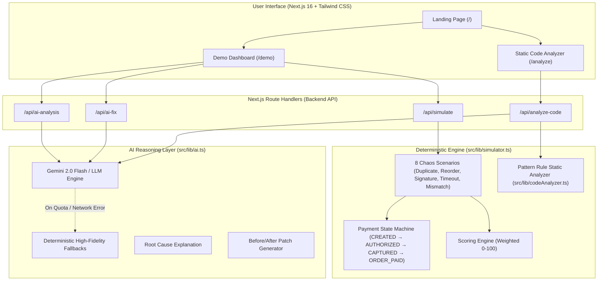

# PAYLAB AI — Architecture Specification

## 1. Overview & System Design

PAYLAB AI is an AI-powered payment reliability and chaos testing platform. It splits responsibilities strictly between a **deterministic execution layer** and an **AI reasoning/remediation layer**.

---

## 2. Component Breakdown

### A. Deterministic Payment State Machine & Chaos Simulator (`src/lib/simulator.ts`)
- **State Lifecycle:** `CREATED` $\rightarrow$ `AUTHORIZED` $\rightarrow$ `CAPTURED` $\rightarrow$ `ORDER_PAID`
- **Chaos Injections:**
  1. **Duplicate Webhook Delivery:** Re-delivers identical event IDs to verify deduplication before order fulfillment.
  2. **Out-of-Order Webhook Delivery:** Delivers `CAPTURED` event prior to `AUTHORIZED` to ensure buffering and reconciliation rather than invalid state progression.
  3. **Webhook Timeout + Retry:** Simulates upstream network timeout re-deliveries.
  4. **Invalid Webhook Signature:** Simulates forged HMAC-SHA256 signature payloads.
  5. **State Mismatch:** Simulates client-side spoofed status ("paid") vs gateway truth ("authorized").
  6. **Idempotency Key Verification:** Tests duplicate capture requests against replay vulnerabilities.
  7. **API Retries & Storms:** Verifies resilience under repeated network retries.

### B. Deterministic Scoring Engine (`src/lib/simulator.ts`)
Scores are calculated via closed-form weighted metrics (no LLM hallucinations):
- **Webhook Reliability:** 25 points
- **State Consistency:** 20 points
- **Idempotency:** 20 points
- **Error Recovery:** 15 points
- **Security:** 10 points
- **API Reliability:** 10 points
- **Total:** 100 points

### C. Static Pattern Analyzer (`src/lib/codeAnalyzer.ts`)
Inspects user-pasted or uploaded payment handlers for common vulnerabilities:
- Missing idempotency guards (`hasIdempotencyCheck`)
- Missing webhook signature verification (`verifyWebhookSignature`)
- Trusting client-side status parameters (`trustsClientStatus`)
- Unsafe retry loops without deduplication
- Direct mutation of order state without transition validation
- Exposed API secrets / hardcoded tokens

### D. AI Reasoning & Patch Generator (`src/lib/ai.ts`)
- **Ground Truth Grounding:** AI prompt takes deterministic test failure evidence and reasons over real production consequences.
- **Fail-Safe Fallbacks:** If API quota is exhausted or offline, high-fidelity deterministic explanations and patches are seamlessly rendered without breaking the UI.

---

## 3. Data Flow & Security Boundaries
1. **Zero Secret Storage:** Public demos use synthetic transactions and mocks; no live credentials or API secrets are stored or queried.
2. **Server-Side AI Proxy:** Gemini API keys are evaluated strictly inside Next.js server route handlers.
