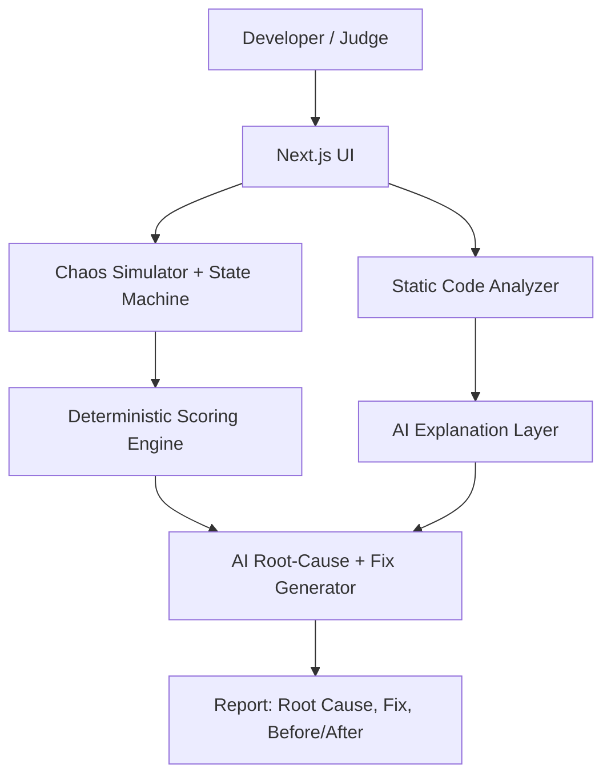

# PAYLAB AI

**Break your payment system before your customers do.**

AI-powered reliability and chaos testing for payment integrations, built for the
Razorpay AI Buildathon (Open Track).

---

## 1. Problem

Payment integrations are almost always tested against the happy path. In production,
failures show up in the unhappy paths: retried webhooks, out-of-order events, forged
requests, and race conditions between the gateway and the app's own database. These
bugs are invisible in a demo and expensive once real customers hit them — duplicate
fulfillment, forged "paid" states, stuck orders.

## 2. Why this problem matters

Razorpay's own documentation calls out exactly these failure modes — webhook retries,
duplicate delivery, out-of-order events, signature verification, idempotency. Most
teams learn about them only after an incident. PAYLAB AI lets a developer discover
them in minutes, on synthetic data, with zero risk.

## 3. Solution

PAYLAB AI simulates a fictional ecommerce checkout, **ShopKart**, that has several
intentionally seeded reliability bugs. A visitor can:

1. Run a deterministic chaos test suite against ShopKart's webhook handling.
2. See exactly which scenarios fail and why (evidence-based, not guessed).
3. Ask AI to explain the root cause and generate a concrete code fix.
4. Re-run the *exact same* deterministic tests and see the reliability score improve.

## 4. How PAYLAB works

- A **deterministic chaos engine** injects duplicate webhooks, out-of-order events,
  timeouts/retries, forged signatures, and client-trust bugs against a small payment
  state machine (`CREATED → AUTHORIZED → CAPTURED → ORDER_PAID`).
- Each test's pass/fail is decided by **plain application code**, not by an LLM.
- A **reliability score** (0–100) is computed from those results using fixed category
  weights (see below).
- **AI** is called only after the deterministic results exist, and only to explain
  them, propose a fix, and suggest a regression test.

## 5. Architecture



- **Frontend:** Next.js (App Router) + TypeScript + Tailwind CSS
- **Backend:** Next.js Route Handlers (`/api/simulate`, `/api/ai-analysis`, `/api/ai-fix`,
  `/api/analyze-code`)
- **AI:** Gemini API (`GEMINI_API_KEY`), called server-side only, never exposed to the browser
- **No database required** for the public demo — everything is computed synthetically per request

## 6. Where AI is used

- Explaining *why* a deterministic failure is dangerous in production
- Generating a concrete before/after code fix for the seeded vulnerability class
- Turning static-analysis findings (from pasted code) into developer-friendly explanations
- Suggesting a regression test to add

## 7. Where AI is deliberately NOT used

- Deciding pass/fail for any chaos test
- Computing the reliability score or any sub-score
- Detecting patterns in pasted code (this is rule-based static analysis)
- Simulating the payment state machine

This split is shown directly in the product ("Why AI" section on the landing page):
deterministic code owns every number; AI owns explanation and remediation.

## 8. Chaos scenarios (deterministic)

| Test | Scenario |
|---|---|
| T01 | Successful payment (happy path) |
| T02 | Duplicate webhook delivery |
| T03 | Out-of-order webhook (CAPTURED before AUTHORIZED) |
| T04 | Webhook timeout + retry |
| T05 | Invalid/forged webhook signature |
| T06 | Payment/order state mismatch (trusting client status) |
| T07 | Missing idempotency key on capture |
| T08 | API reliability under repeated retries |

## 9. Reliability scoring

Computed entirely in `src/lib/simulator.ts` from real test results:

| Category | Weight |
|---|---|
| Webhook Reliability | 25 |
| State Consistency | 20 |
| Idempotency | 20 |
| Error Recovery | 15 |
| Security | 10 |
| API Reliability | 10 |
| **Total** | **100** |

## 10. Failure recovery

PAYLAB intentionally injects failures, identifies them with deterministic tests,
explains the root cause with AI grounded in that evidence, proposes a fix, and reruns
the identical test suite to verify recovery — no test is faked or reworded between runs.

## 11. Before/after evidence

The demo ships two named configurations: `SEEDED_SHOPKART` (broken) and
`FIXED_SHOPKART` (idempotency + signature verification + out-of-order handling added).
Both are run through the same simulator and scorer. The improvement shown on screen is
the literal difference between two real function calls — nothing is hardcoded.

## 12. Razorpay relevance

The scenarios map directly to concepts in Razorpay's own webhook documentation:
retries, duplicate delivery, event ordering, idempotency, and signature verification.
PAYLAB AI is an independent buildathon project using these concepts and Test
Mode–compatible workflows. **It is not affiliated with or endorsed by Razorpay**, does
not use live credentials, and never processes real money.

## 13. Security

- No live payment credentials are ever requested
- No offensive security testing — this is a defensive developer tool
- `GEMINI_API_KEY` is read server-side only and never sent to the browser
- Static "security checks" only look for missing signature verification, client-trust
  bugs, and obvious hardcoded-secret patterns in pasted code

## 14. Tech stack

Next.js 16, TypeScript, Tailwind CSS, Vitest. AI: Gemini API with a deterministic
fallback so the product works even with zero AI quota.

## 15. Running locally

```bash
npm install
npm run dev
```

Open http://localhost:3000. The public demo works immediately with no configuration.

To enable live AI reasoning, copy `.env.example` to `.env.local` and set `GEMINI_API_KEY`.

## 16. Deployment

```bash
npm run build
npm start
```

Recommended host: Vercel (Hobby tier). Set `GEMINI_API_KEY` as an environment variable
in the project settings — the app runs correctly with or without it.

## 17. Limitations

- The chaos suite covers 8 representative scenarios, not an exhaustive benchmark
- The code analyzer uses pattern-based static rules, not a full AST/security audit
- AI explanations are only as good as the underlying model's response; a deterministic
  fallback covers outages but is intentionally simpler than a live AI explanation

## 18. Future roadmap

- Optional real Razorpay Test Mode webhook replay
- Expand the synthetic benchmark to measure detection precision/recall
- Persist demo runs (Supabase) for a public leaderboard
- Additional chaos scenarios (partial refunds, currency mismatches, split settlements)

---

### Testing

```bash
npm test
```

Covers the simulator's pass/fail logic, score determinism and improvement after fixes,
and the static code analyzer's detection rules.
